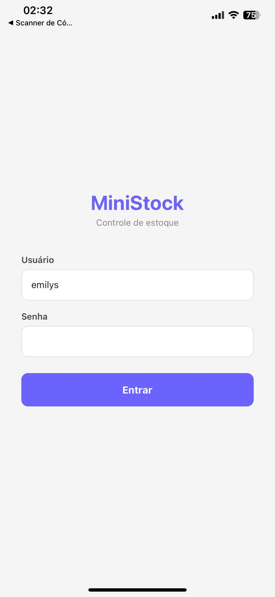
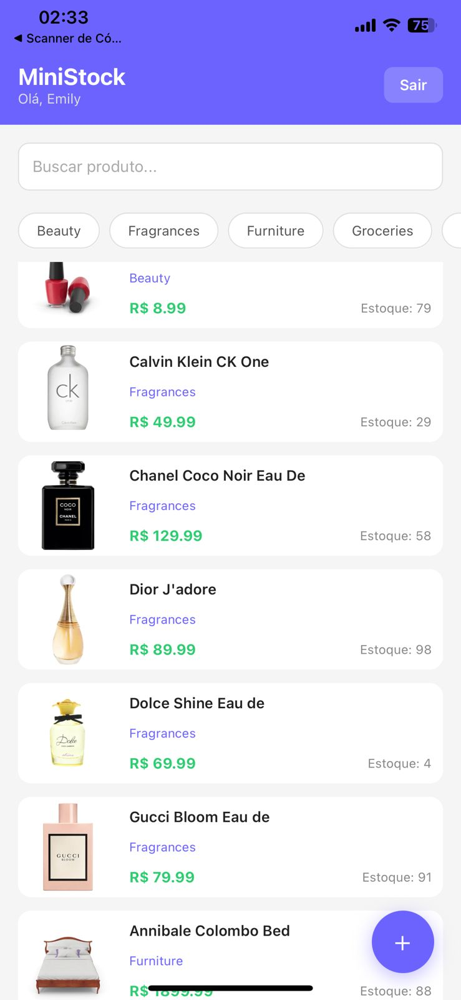
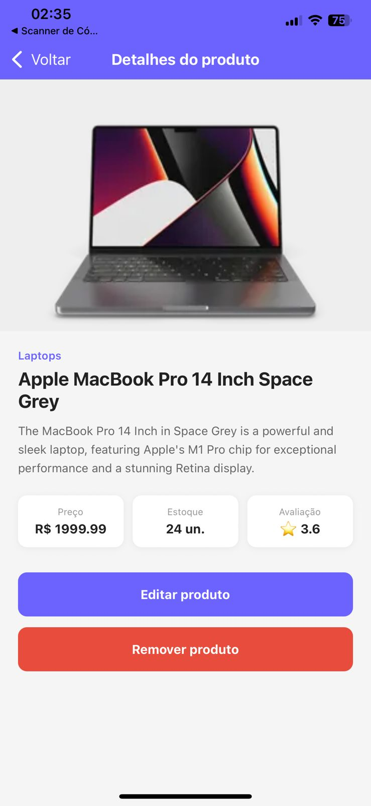
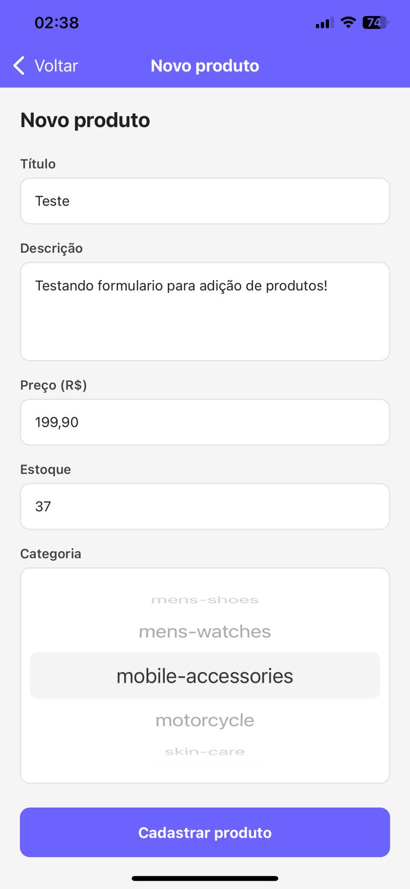

# MiniStock Mobile

App mobile de controle de estoque desenvolvido em React Native com Expo para a disciplina de Programação para Dispositivos Móveis. O aplicativo permite que colaboradores consultem, cadastrem, editem e removam produtos do catálogo em tempo real, diretamente pelo celular, consumindo a API pública DummyJSON.

---

## Tecnologias utilizadas

| Tecnologia | Versão | Finalidade |
|---|---|---|
| React Native | 0.81.5 | Framework mobile |
| Expo | SDK 54 | Plataforma de desenvolvimento |
| Axios | Latest | Requisições HTTP |
| React Navigation | 7.x | Navegação entre telas |
| AsyncStorage | Latest | Persistência local do token |
| DummyJSON | - | API REST de simulação |
| @react-native-picker/picker | Latest | Seletor de categorias |

---

## Funcionalidades

### Autenticação
- Login com usuário e senha via API
- Token JWT persistido no AsyncStorage
- Sessão mantida entre aberturas do app
- Logout com confirmação

### Listagem de produtos
- FlatList com paginação infinita via `onEndReached`
- Pull to refresh com `RefreshControl`
- Busca textual em tempo real com debounce de 500ms
- Filtro por categoria carregado dinamicamente da API
- Indicador de carregamento ao trocar de categoria

### Detalhes do produto
- Exibição de imagem, título, descrição, preço, estoque e avaliação
- Botão de edição com formulário pré-preenchido
- Botão de exclusão com diálogo de confirmação

### Cadastro e edição
- Formulário reutilizado para criação e edição
- Seletor de categorias carregado da API
- Validação de campos antes do envio
- Estado local atualizado imediatamente após sucesso

### Gerenciamento de estado local
- Produtos criados e editados mantidos em memória durante o uso
- Filtros respeitam alterações locais
- Exclusão refletida imediatamente na listagem

---

## Instalação e execução

### Pré-requisitos

- [Node.js](https://nodejs.org/) (versão 18 ou superior)
- [Git](https://git-scm.com/)
- Expo Go instalado no celular:
  - [Android - Google Play](https://play.google.com/store/apps/details?id=host.exp.exponent)
  - [iOS - App Store](https://apps.apple.com/app/expo-go/id982107779)

### Passo a passo

```bash
# 1. Clone o repositório
git clone https://github.com/BrunoDonato/ministock.git

# 2. Acesse a pasta do projeto
cd ministock

# 3. Instale as dependências
npm install

# 4. Inicie o servidor de desenvolvimento
npx expo start
```

Após iniciar, escaneie o QR code exibido no terminal com o aplicativo Expo Go no celular. O app e o celular precisam estar na mesma rede Wi-Fi.

---

## Credenciais de teste

```
Usuário: emilys
Senha:   emilyspass
```

---

## Estrutura do projeto

```
ministock/
├── src/
│   ├── services/
│   │   ├── api.js              # Instância axios com baseURL, timeout e interceptors
│   │   ├── auth.js             # Login, logout e recuperação do usuário salvo
│   │   └── products.js         # CRUD completo de produtos e categorias
│   ├── contexts/
│   │   ├── AuthContext.js      # Contexto global de autenticação
│   │   └── ProductsContext.js  # Contexto de estado local dos produtos
│   ├── screens/
│   │   ├── LoginScreen.js          # Tela de login
│   │   ├── ProductListScreen.js    # Listagem com busca, filtro e paginação
│   │   ├── ProductDetailScreen.js  # Detalhes, edição e exclusão
│   │   └── ProductFormScreen.js    # Formulário de criação e edição
│   └── components/
│       ├── CategoryList.js     # Lista horizontal de filtros por categoria
│       ├── ProductCard.js      # Card reutilizável de produto
│       ├── Loading.js          # Indicador de carregamento
│       └── EmptyState.js       # Estado vazio da listagem
├── App.js                      # Raiz do app com navegação e providers
├── app.json                    # Configurações do Expo
├── package.json
└── README.md
```

---

## Arquitetura e decisões técnicas

### Instância única do Axios
Toda comunicação com a API passa por `src/services/api.js`, que exporta uma instância configurada com `baseURL` e `timeout`. Nenhuma tela faz chamadas diretas ao axios.

### Interceptor de requisição
Antes de cada requisição, o token armazenado no AsyncStorage é injetado automaticamente no cabeçalho `Authorization: Bearer`.

### Interceptor de resposta
Erros são tratados de forma centralizada:
- **401** - Token expirado: limpa o AsyncStorage e redireciona para o login
- **404** - Recurso não encontrado: mensagem amigável ao usuário
- **5xx** - Erro no servidor: mensagem amigável ao usuário
- **Timeout / sem rede** - Mensagem de sem conexão

### Camada de serviços
Toda lógica de comunicação com a API está isolada em `src/services/`. As telas apenas importam funções e recebem os dados prontos, sem contato direto com o axios.

### Estado local em memória
Como a DummyJSON simula as operações de escrita sem persistir, o app mantém um contexto (`ProductsContext`) com os produtos criados e as edições realizadas durante a sessão, refletindo as mudanças imediatamente na interface.

---

## Endpoints consumidos

| Ação | Método | Endpoint |
|---|---|---|
| Login | POST | `/auth/login` |
| Listar produtos | GET | `/products` |
| Buscar produtos | GET | `/products/search` |
| Listar categorias | GET | `/products/category-list` |
| Produtos por categoria | GET | `/products/category/{slug}` |
| Detalhes do produto | GET | `/products/{id}` |
| Cadastrar produto | POST | `/products/add` |
| Atualizar produto | PUT | `/products/{id}` |
| Remover produto | DELETE | `/products/{id}` |

---

## Capturas de tela

 

 

---

## Vídeo demonstrativo

[Clique aqui para assistir no YouTube](https://youtu.be/M6O56Pk58GE) ou  https://youtu.be/M6O56Pk58GE

---

## Autor

**Bruno Donato** - 
Ciência da Computação - UNIPAC
Disciplina: Programação para Dispositivos Móveis
---